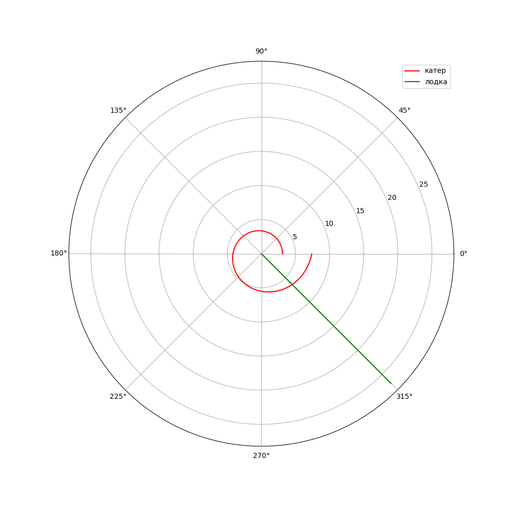
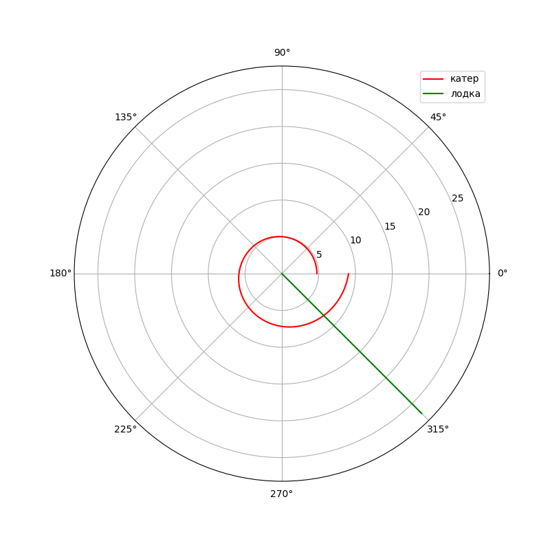

---
## Front matter
lang: ru-RU
title: "Задача о погоне - вариант 53"
author: |
	 Юрченко Сергей НФИбд-02-19\inst{1}

institute: |
	\inst{1}Российский Университет Дружбы Народов

date: 20 мая, 2022, Москва, Россия

## Formatting
mainfont: PT Serif
romanfont: PT Serif
sansfont: PT Sans
monofont: PT Mono
toc: false
slide_level: 2
theme: metropolis
header-includes: 
 - \metroset{progressbar=frametitle,sectionpage=progressbar,numbering=fraction}
 - '\makeatletter'
 - '\beamer@ignorenonframefalse'
 - '\makeatother'
aspectratio: 43
section-titles: true

---
# Цель работы
## Цель лабораторной работы

Дана задача: На море в тумане катер береговой охраны преследует лодку браконьеров. Через определенный промежуток времени туман рассеивается, и лодка обнаруживается на расстоянии k км от катера. Затем лодка снова скрывается в тумане и уходит прямолинейно в неизвестном направлении. Известно, что скорость катера в n раза больше скорости браконьерской лодки. 
Необходимо определить по какой траектории необходимо двигаться катеру, чтоб нагнать лодку. 
Нам необходимо разобраться в том, как решить эту задачу, написать код для решения диф.уравнений, которые лягут в основу решения, после чего необходимо будет смоделировать математическую модель, с помощью который можно будет наглядно определить оптимальный путь береговой охраны. 

## Задание к лабораторной работе

1. Теоретически выделить необходимые сведения из задачи и сопутствующих источников.
2. Вывести диф.уравнения для двух случаев ( когда сторость катера больше скорости лодки в *n* раз и наоборот).
3. Написать код программы.
4. Построить траетории двидения.
5. Определить по графикам наиболее выгодный путь.

# Процесс выполнения лабораторной работы

## Теоретический материал :

* Для того, чтобы начать составлять уравнение необходимо определить важные параметры, а именно: 
место нахождения лодки браконьеров в момент обнаружения - будет приниматься за $t_0=0, X_0=0$ 
место нахождения катера береговой охраны относительно лодки браконьеров в момент обнаружения лодки - будет приниматься за $X_0=k$.

* 3. Чтобы найти расстояние после которого катер начнет двигаться вокруг полюса ( $x$ ), необходимо составить простое уравнение: пусть через время $t$ катер и лодка окажутся на одном расстоянии $x$ от полюса. За это время лодка пройдет $x$, а катер $x-k$ (или $x+k$, в зависимости от начального положения катера относительно полюса).Время, за которое они пройдут это расстояние, вычисляется как $\frac{x}{υ}$ или $\frac{x+k}{υ}$ (для второго случая $\frac{x-k}{υ}$). 
Пусть через время $t$ катер и лодка окажутся на одном расстоянии $x$ от полюса. За это время лодка пройдет $x$, а катер $x-k$ (или $x+k$).
Тогда неизвестное расстояние можно найти из следующего уравнения:  $\frac{x}{υ} = \frac{x+k}{υ}$ - в первом случае, $\frac{x}{υ} =  \frac{x-k}{υ}$ во втором случае.

## Теоретический материал :

Отсюда мы найдем два значения $x_1$ и $x_2$, задачу будем решать для двух случаев: 

1. $x_1=\frac{k}{n+1}$ ,при $\theta=0$

2. $x_2=\frac{k}{n-1}$ ,при $\theta=-\pi$

## Теоретический материал 

Найдем тангенциальную скорость для нашей задачи $υ_t=r\frac{d\theta}{dt}$.
Вектора образуют прямоугольный треугольник, откуда по теореме Пифагора можно найти тангенциальную скорость $υ_t= \sqrt{n^2 υ_r^2-v^2}$. 
Поскольку, радиальная скорость равна $υ$, то тангенциальную скорость находим из уравнения $υ_t= \sqrt{n^2 υ^2-υ^2 }$. Следовательно, $υ_τ=υ\sqrt{n^2-1}$.
Тогда получаем $r\frac{d\theta}{dt}=υ\sqrt{n^2-1}$

## Теоретический материал 

Решение исходной задачи сводится к решению системы из двух дифференциальных уравнений 

$$
 \begin{cases}
   \frac{dr}{dt}=υ
	\\   
	r\frac{d\theta}{dt}=υ\sqrt{n^2-1}
 \end{cases}
$$

с начальными условиями

$$
 \begin{cases}
   \theta_0=0
   \\
	r_0=\frac{k}{n+1}
 \end{cases}
\
$$

$$
 \begin{cases}
   \theta_0=-\pi
   \\
	r_0=\frac{k}{n-1}
 \end{cases}
\
$$

## Теоретический материал 

Исключая из полученной системы производную по t, можно перейти к следующему уравнению: $\frac{dr}{d\theta}=\frac{r}{\sqrt{n^2-1}}$

Начальные условия остаются прежними. Решив это уравнение, мы получим
траекторию движения катера в полярных координатах. 

## Условие задачи
Уточним условия задачи: 
На море в тумане катер береговой охраны преследует лодку браконьеров.
Через определенный промежуток времени туман рассеивается, и лодка обнаруживается на расстоянии 17.6 км от катера. 
Затем лодка снова скрывается в тумане и уходит прямолинейно в неизвестном направлении. 
Известно, что скорость катера в 4.7 раза больше скорости браконьерской лодки

## Результаты

{ #fig:001 width=50% height=50% }

точка пересечения катера и лодки
$$
 \begin{cases}
   \theta=315
   \\
	r=6.38
 \end{cases}
\
$$

## Результаты

{ #fig:002 width=50% height=50% }

точка пересечения катера и лодки
$$
 \begin{cases}
   \theta=315
   \\
	r=8.05
 \end{cases}
\
$$

# Выводы по проделанной работе

## Выводы

Мы рассмотрели задачу о погоне катера за лодкой, научились применять ранее изученные дисциплины, написали код программы, который позволяет проанализировать смоделированные ситуации. Сделали вывод с помощью моделей. 

