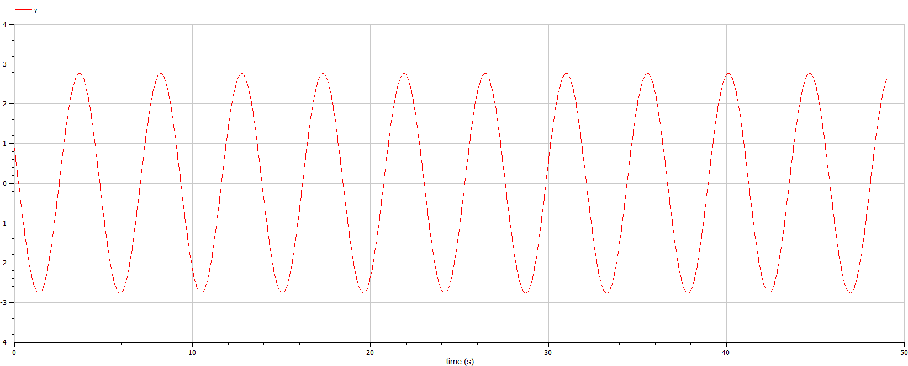
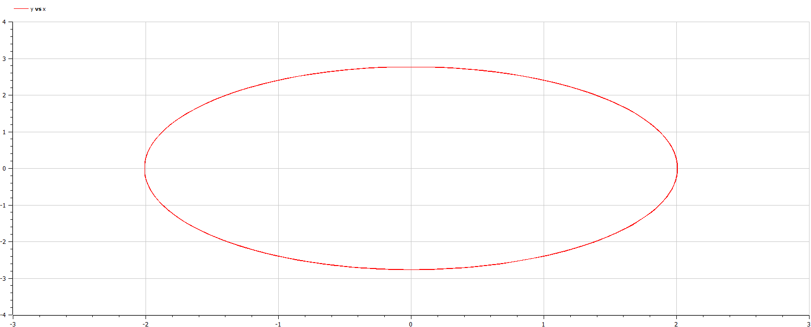
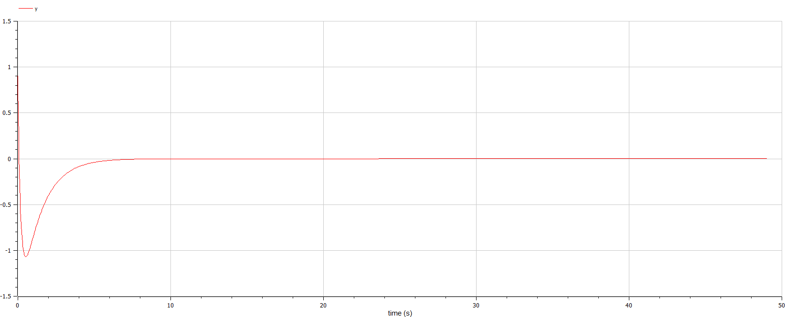
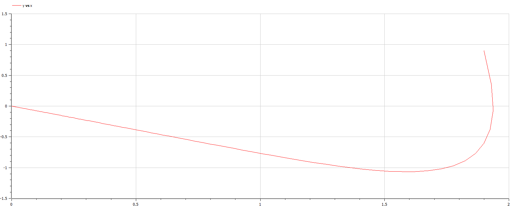
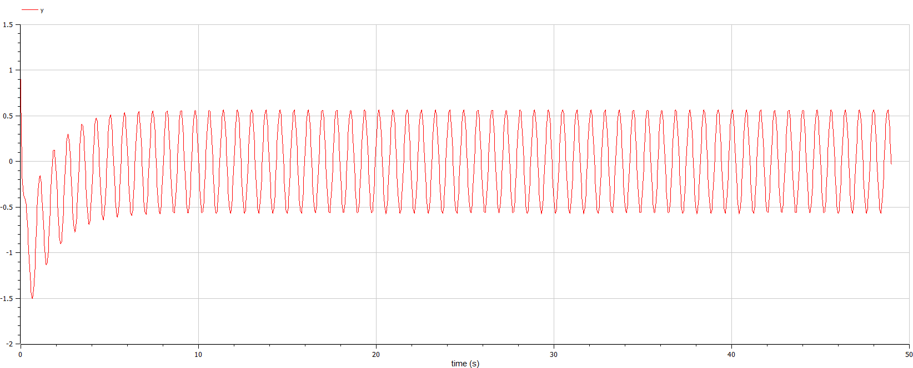
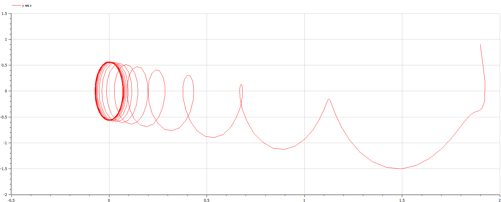

---
## Front matter
lang: ru-RU
title: Модель гармонических колебаний. Лабораторная №4
author: |
	 Юрченко Сергей НФИбд-02-19\inst{1}

institute: |
	\inst{1}Российский Университет Дружбы Народов

date: 20 мая, 2022, Москва, Россия

## Formatting
mainfont: PT Serif
romanfont: PT Serif
sansfont: PT Sans
monofont: PT Mono
toc: false
slide_level: 2
theme: metropolis
header-includes: 
 - \metroset{progressbar=frametitle,sectionpage=progressbar,numbering=fraction}
 - '\makeatletter'
 - '\beamer@ignorenonframefalse'
 - '\makeatother'
aspectratio: 43
section-titles: true

---

# Цели и задачи работы

## Цель лабораторной работы

Изучить уравнение гармонического осцилятора без затухания. Записать данное уравнение и построить фазовый портрет гармонических и свободных колебаний. 

## Задание к лабораторной работе

1.	Построить решение уравнения гармонического осциллятора без затухания
2.	Записать уравнение свободных колебаний гармонического осциллятора с затуханием, построить его решение. После построить фазовый портрет гармонических колебаний с затуханием.
3.	Записать уравнение колебаний гармонического осциллятора, если на систему действует внешняя сила, построить решение и фазовый портрет.

# Ход работы лабораторной:

## Теоретический материал 

Движение грузика на пружинке, маятника, заряда в электрическом контуре, а также эволюция во времени многих систем в физике, химии, биологии и других науках при определенных предположениях можно описать одним и тем же дифференциальным уравнением, которое в теории колебаний выступает в качестве основной модели. Эта модель называется линейным гармоническим осциллятором.
Уравнение свободных колебаний гармонического осциллятора имеет следующий вид:
$$\ddot{x}+2\gamma\dot{x}+\omega_0^2=0$$

## Теоретический материал 

При отсутствии потерь в системе ( $\gamma=0$ ) получаем уравнение консервативного осциллятора энергия колебания которого сохраняется во времени.
$$\ddot{x}+\omega_0^2x=0$$

## Теоретический материал 

Для однозначной разрешимости уравнения второго порядка необходимо задать два начальных условия вида
 
$$
 \begin{cases}
	x(t_0)=x_0
	\\   
	\dot{x(t_0)}=y_0
 \end{cases}
$$

## Теоретический материал 

Уравнение второго порядка можно представить в виде системы двух уравнений первого порядка:
$$
 \begin{cases}
	x=y
	\\   
	y=-\omega_0^2x
 \end{cases}
$$

## Теоретический материал 

Начальные условия для системы примут вид:
$$
 \begin{cases}
	x(t_0)=x_0
	\\   
	y(t_0)=y_0
 \end{cases}
$$

## Условие задачи

Постройте фазовый портрет гармонического осциллятора и решение уравнения гармонического осциллятора для следующих случаев 

1. Колебания гармонического осциллятора без затуханий и без действий внешней силы $\ddot{x}+21x=0$
2. Колебания гармонического осциллятора c затуханием и без действий внешней силы $\ddot{x}+2.2\dot{x}+2.3x=0$
3. Колебания гармонического осциллятора c затуханием и под действием внешней силы $\ddot{x}+2.4\dot{x}+2.5x=0.2\sin{2.6t}$

На итнтервале $t \in [ 0;49 ]$, шаг 0.05, $x_0=1.9, y_0=0.9$

## Случай 1. 
* Колебания гармонического осциллятора без затуханий и без действий внешней силы

$$\ddot{x}+1.9x=0$$

{ #fig:001 width=70% height=70% }

## Случай 1. 
*  Колебания гармонического осциллятора без затуханий и без действий внешней силы

$$\ddot{x}+1.9x=0$$

{ #fig:002 width=70% height=70% }

## Случай 2. 
*  Колебания гармонического осциллятора c затуханием и без действий внешней силы

$$\ddot{x}+2.9\dot{x}+3.9x=0$$

{ #fig:003 width=70% height=70% }

## Случай 2. 
*  Колебания гармонического осциллятора c затуханием и без действий внешней силы

$$\ddot{x}+2.9\dot{x}+3.9x=0$$

{ #fig:004 width=70% height=70% }

## Случай 3. 
*  Колебания гармонического осциллятора c затуханием и под действием внешней силы

$$\ddot{x}+4.9\dot{x}+5.9x=6.9\sin{7.9t}$$

{ #fig:005 width=70% height=70% }

## Случай 3. 
*  Колебания гармонического осциллятора c затуханием и под действием внешней силы

$$\ddot{x}+4.9\dot{x}+5.9x=6.9\sin{7.9t}$$

{ #fig:006 width=70% height=70% }

# Выводы по проделанной работе

## Вывод

В ходе выполнения лабораторной работы мы построили решения уравнений гармонического осциллятора, а также фазовые портреты для трех случаев:
1. Колебания гармонического осциллятора без затуханий и без действий внешней силы
2. Колебания гармонического осциллятора c затуханием и без действий внешней силы
3. Колебания гармонического осциллятора c затуханием и под действием внешней силы
